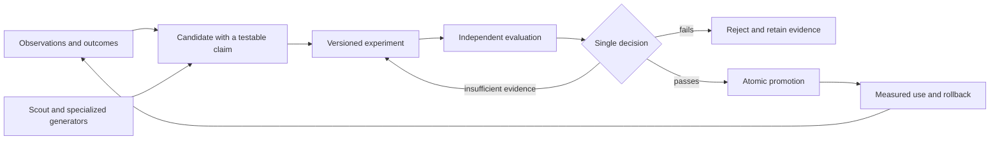

# Blender self-learning audit — 4 September 2026

Audit record: WI-2144472. Requested by owner. Scope: architecture, implementation, evidence quality, release readiness, and improvements. This is an audit and redesign recommendation; it does not implement the recommendations or authorize resuming paused learning routines.

**Recommendation: redesign the decision and evaluation core before release, while retaining the useful execution, provenance, and experimentation infrastructure.** The product idea is sound. The present implementation has several incompatible meanings of “success,” and the final authority to change behavior does not consistently consume the evidence produced by evaluation.

The most serious finding is concrete: Gym's automatic promotion can accept a candidate that its optimizer rejected for regressions, missed probes, and excessive cost. A calibrated, in-memory reproduction confirmed that path. A second reproduction confirmed an invalid statistical confidence claim in Blender's release instrument.

**Scope and evidence.** Deep source tracing covered Scout generation/routing/provenance/reward, Gym optimization/collection/promotion/spend, learning governance, the experiment interface, release metrics, and the efficacy read/UI. Additional architectural sampling covered calibration, transfer, regret mining, and Red Queen. This is not exhaustive security verification of federation, the entire memory backend, or every auxiliary learning routine. Product source was inspected in the canonical staging tree; an observed staging HEAD near the end of the audit was `f49702d62aee4a8e5a311e2e9bc8e4f2ad70ee44`. That is a tree reference, not proof these findings ran on the deployed build.

Source links below are repository-relative and refer to the implementation inspected on this date. The shared tree can continue changing.

**What the system actually learns**

| Path | What changes | Assessment |
|---|---|---|
| Reactive capture | Recorded observations, work-items, retained lessons and recipes | Useful operational substrate. Capture itself is not evidence of improvement. |
| Scout | Idea generation shaped by corpus, reviewer feedback, prior filings, archive seeds, and lens weights | A credible discovery mechanism, but its reward conflates appeal, completion, and effectiveness. |
| Gym | Candidate role-prompt overrides, selected using task runs and judges | Worth keeping as an executor. Its final promotion boundary needs replacement. |
| Experiments/replay | Comparisons of baseline and candidate arms across supported subjects | The best existing foundation for a common evaluation contract. |
| Calibration | Prediction scores and confidence weights | Proper Brier scoring and sample shrinkage are good primitives; meaningful outcomes and domain baselines still matter. |
| Transfer/regret/Red Queen | Distilled lessons, counterfactual candidates, and fault-drill evidence | Keep as specialized evidence/candidate producers; avoid letting each invent its own meaning of validated. |

The inspected mechanisms adapt prompts, context, selection, and retained knowledge. They do not demonstrate model-weight training. That is a reasonable architectural choice; adding fine-tuning would not repair an incorrect reward or promotion contract.

**Release-blocking findings**

1. **Automatic promotion bypasses the optimizer's verdict.**

   The optimizer records proposals for both accepted and rejected candidates. The proposal recorder drops `rec.verdict`. After the optimization loop returns, `autoDecideRunProposals` selects pending rows and accepts any finite `dev_anchor_delta > 0`. It does not require the optimizer's cost, regression, probe, or train-improvement gates. `decideProposal` then writes the prompt override.

   Evidence: [loop.ts](../../../packages/operator-core/lib/gym/loop.ts), especially the unconditional proposal recording at 263–275; [control-plane.ts](../../../packages/operator-core/lib/gym/control-plane.ts), auto-decision at 493–521, override write at 538–544, and recorder at 694–719; [autoloop-cycle.ts](../../../packages/operator-core/lib/gym/autoloop-cycle.ts), post-run auto-decision at 570–587. Some comments still describe a human-gated flow; the executable path automatically decides.

   Reproduction: transpiled the actual gate and control-plane source in the same JavaScript realm, supplied in-memory SQL and no-op external effects, and first calibrated a valid candidate that passes. A negative candidate failed `no-new-regressions`, `probe-caught`, and `cost`; the auto-decision nevertheless returned `{accepted:1,rejected:0}` and issued one in-memory override write. No real prompt was changed. An earlier cross-realm probe was discarded because it failed the positive control.

   Related weakness: this caller supplies `baselineOfRecord:0`, `dropThreshold:1000`, and a fixed `baselineMeanCost:1`. The arithmetic rollback threshold is consequently ineffective over normal judge scores. Automatic decisions also happen per role, whereas evaluation measures a complete variant; partial application can create an untested combination.

   **Change:** one immutable evaluation verdict must authorize promotion of the complete candidate against an identified parent. Use a transaction and a current-parent check. A rejected or inconclusive experiment must never reach an alternate acceptance formula. Persist the rollback version before activation. Tracked as **EI-22365149091665582**.

2. **The default real A/B adapter loses deterministic regression evidence.**

   `buildAbDeps.collectAndDistill` passes no `signals` to `collectTraceByStrategy`. The collector only carries the supplied signals, so the adapter returns `{}`. `buildLoopDeps.evaluate` treats a missing `sig.regressions` as false; if no probe tasks are supplied, it also treats all probes as caught. The autoloop uses this default adapter.

   Evidence: [ab-runner-real.ts](../../../packages/operator-core/lib/gym/ab-runner-real.ts), 149–192; [collect-strategies.ts](../../../packages/operator-core/lib/gym/collect-strategies.ts), 105; [loop-deps.ts](../../../packages/operator-core/lib/gym/loop-deps.ts), 215–253. Existing loop-deps tests inject a fake adapter with the desired signals, so those tests do not establish that the production adapter supplies them.

   This does not prove every underlying task skips testing. It proves that this particular acceptance gate receives no deterministic regression measurement through the traced adapter.

   **Change:** require typed measurements: pass, fail, or not measured, with task coverage and artifact references. Missing required measurements must produce an inconclusive verdict. Test the default adapter through the promotion boundary. Tracked as **EI-22365043549794437**.

3. **The release error-rate confidence claim is mathematically wrong.**

   `evaluateProgramSuccess` checks the observed error fraction, then uses sample-size thresholds of 9 and 60. At 60 it claims a literal error bound below 5% at 95% confidence, even when errors are nonzero. The rule of three used to justify 60 is a zero-error rule.

   Evidence: [success-metrics.ts](../../../packages/operator-core/lib/scout/success-metrics.ts), 237–261 and 414–460. Replaying the exact current branch with **2 errors among 60 cycles** returned **pass** and the claimed 95% bound. The exact one-sided binomial upper 95% bound is approximately **10.12%**, not 5%. This is a synthetic reproduction, not the current production error rate.

   **Change:** calculate an actual confidence bound from successes and failures; compare that bound with the promised bar. Separate “better than the historical baseline” from “meets the release target.” Predeclare the observation window and handle repeated peeking explicitly. Tracked as **EI-22365039972303407**.

4. **The learning budget is not a complete spending boundary.**

   Scout explicitly continues through later spending stages after exceeding its cycle cap; `overBudget` reports the overshoot. Preserving already-generated ideas is sensible, but the cap is advisory. In Gym, `proposeCandidate` discards the LLM response's cost, and `runOptimizationLoop.spentUsd` adds only completed evaluations. A failed proposal or a partially completed evaluation can incur costs without entering that optimizer counter. The baseline evaluation also runs before the loop's budget check.

   Evidence: [cycle.ts](../../../packages/operator-core/lib/scout/cycle.ts), 407–435; [proposer.ts](../../../packages/operator-core/lib/gym/proposer.ts), 129–149; [loop.ts](../../../packages/operator-core/lib/gym/loop.ts), 174–175 and 194–240; [learning-governor/store.ts](../../../packages/operator-core/lib/learning-governor/store.ts), preflight at 194–202 and post-spend recording at 228–250.

   This finding concerns the learning loop's accounting and cap, not an allegation that provider billing or every global usage ledger omits these calls.

   **Change:** extend the existing governor/admission and spend ledgers with reservation and settlement for every spending attempt, including failures and cancellation. Reserve a finish budget before generation; persist unfinished stage artifacts and resume when budget is available. Keep a separately named advisory optimization target if useful. Gym cost omission is tracked as **EI-22365041436058496**.

**Core design problems**

5. **Reviewer preference dominates observed outcomes.** In [outcome-feedback.ts](../../../packages/operator-core/lib/scout/outcome-feedback.ts), 389–408, a valid grade contributes `(grade-1)/4` win credit and bypasses the terminal-outcome classification. This is deliberate and tested. A five-star idea can fail later and still supply full positive credit to its lens. The live all-time `origin='scout'` snapshot contained **seven rows with grades at least four and stored losing outcomes**. These are cached ledger labels; the audit did not recompute every historical artifact's fate.

   Keep reviewer grades as usefulness/preference signals and as priors when outcomes are immature. Store delivery, measured benefit, cost, regressions, and preference as separate dimensions. Matured outcome evidence should update effectiveness; it should not be overwritten by an earlier opinion. Where several source ideas contribute to one artifact, prevent that artifact from being counted as several independent successes. `deriveProvenance` intentionally expands a routed artifact to source ideas, while the outcome tally counts each row.

6. **The system often measures completion instead of causal benefit.** Scout's terminal states are useful delivery evidence, but they do not establish that the change improved the product. Gym's post-acceptance measurement compares 72-hour before/after windows of `spawned_agents` done/failed statuses by harness and role. It does not filter those runs by the actual prompt version used, task mix, or a concurrent control. Its five-run floor and fixed five-point neutral band do not estimate uncertainty.

   Evidence: [post-acceptance-outcomes.ts](../../../packages/operator-core/lib/gym/post-acceptance-outcomes.ts), 39–43, 124–138, and 243–259. Keep this as descriptive monitoring. Use pinned task replays and recorded version exposure to evaluate effects; where feasible, randomize comparable tasks between baseline and candidate. A system-wide before/after difference should not be credited automatically to one prompt.

7. **Selection and evaluation need separate datasets and authority.** Gym already has useful train/dev/real-anchor distinctions, pinned real tasks, repeated-run support, and a report-set firewall. Preserve them. However, repeatedly selecting against the same dev-anchor makes it part of the optimization process. A scored real task is not by itself a sealed release test. The release corpus bar verifies real-labelled tasks with scored runs; it does not prove improvements transfer to held-out work.

   Use a development set for iteration, an inaccessible acceptance holdout for promotion, and fresh monitoring tasks for drift. Version the judge, rubric, dataset, model, prompts, and code together. Require deterministic task checks wherever possible; use blinded judges for qualities that need judgment. Reserve evaluator changes for separately evaluated changes. The statistical issue of adapting repeatedly to a holdout is established in [Generalization in Adaptive Data Analysis and Holdout Reuse](https://arxiv.org/abs/1506.02629).

8. **Pot-local learning and workspace-wide learning remain competing models.** The learning overview mandates pot attribution. Yet `refreshScoutOutcomes` intentionally clears `harnessSlug` when gathering the training corpus, and `workspaceBrainScopeKey` maps weights to the workspace key when coordination is enabled. `readRoutedIdeas` accepts `potSlug` in its options but its query does not apply that predicate. This is a concrete ownership/semantics mismatch, not proof of a cross-workspace security leak.

   Evidence: [routed-ledger.ts](../../../packages/operator-core/lib/scout/routed-ledger.ts), 618–633 and 1367–1478; [workspace-brain-scope.ts](../../../packages/operator-core/lib/workspace-brain-scope.ts), 154–169; [self-learning overview](../../operator-docs/src/content/docs/system/self-learning.mdx).

   Make the learning policy's owner explicit. Default to pot-specific observations and policy updates. Offer workspace aggregate reporting separately. Transfer lessons across pots through an explicit, provenance-preserving channel that records permission and target applicability. Shared priors can be useful; silently pooled training is a different product choice.

9. **The efficacy UI overstates what some metrics mean.** `championDeltaMetric` selects the newest scored summary and subtracts a hardcoded historical baseline. It does not establish that the selected row is a deployed champion or that benchmark/judge versions remain comparable. The panel labels it “champion Δ vs gen-0.”

   Evidence: [efficacy-read.ts](../../../packages/operator-core/lib/learning/efficacy-read.ts), `GEN0_BASELINE` and `championDeltaMetric`; [LearningEfficacyPanel.tsx](../../operator-vite/src/components/adv/LearningEfficacyPanel.tsx).

   Separate operational health, delivery, and demonstrated learning. The product should answer: what changed; on which tasks; against which baseline; what improved; what it cost; how certain we are; which version is active; and how to undo it. “No matured evidence,” “paused by you,” and “measurement failed” need distinct states.

10. **Do not turn every local failure into a universal instruction.** Regret mining's candidate library includes blanket rules such as never reissuing an identical tool call, on the premise that identical inputs return identical results. That premise fails for stateful systems. These are proposed candidates, not proof the rules were installed, but the induction bias is too broad.

   Evidence: [counterfactual-core.ts](../../../packages/operator-core/lib/replay/regret/counterfactual-core.ts), 58–71. Prefer lessons with applicability conditions, a falsifier, provenance, expiry/review, and positive/negative examples. Evaluate prompt size and contradictions as costs. Transfer's probation/validation/retirement lifecycle is useful, but a single judge-score delta should not carry a stronger validation claim than its evidence supports.

**The design I would choose**

Keep Scout, reactive observations, regret mining, and drills as ways to discover candidate improvements. Put all changes to behavior through one experiment-and-promotion lifecycle, extending the existing `experiment` / `eval-battery`, work-item, governor, and change-ledger surfaces.

The important contract is the same for a memory entry, recipe, role prompt, configuration change, or code patch:

- **Claim:** target task/population, expected benefit, constraints, failure condition, and budget.
- **Candidate:** immutable artifact and parent version; relevant pot and permissions.
- **Experiment:** pinned task/input, baseline and challenger, all runtime/evaluator versions, seeds/repeats where applicable, and complete cost receipts.
- **Evidence:** objective results, judgment results, measurement coverage, uncertainty, and provenance kept distinct.
- **Decision:** accepted, rejected, or inconclusive, with one authority and an auditable reason.
- **Activation:** atomic deployment of the evaluated artifact, exposure recording, rollback reference, and later outcome checks.

These are conceptual contracts, not a proposal to create six new tables. [experiment/types.ts](../../../packages/operator-core/lib/experiment/types.ts) already has baseline arms, repeats, normalized results, cost, comparison, and a winner. [experiment/run-core.ts](../../../packages/operator-core/lib/experiment/run-core.ts) already provides registered subjects, knob validation, baseline insertion, and fidelity escalation. Extend that seam; retire the competing acceptance logic after adapters preserve current functionality.

Keep learning governors as spend/admission control and schedules as execution mechanisms. Make discovery demand-driven and bounded by the capacity to evaluate and implement candidates. A generator that fills an unevaluated backlog is not becoming more effective. One scheduling/control contract per pot is preferable to adding a new autonomous maintenance loop for every missing feedback edge.

**Optimizer choice.** I would benchmark the current Gym optimizer against a simple reflection baseline and GEPA under identical task splits, models, and total spend. GEPA already combines trace-based reflection with Pareto search and candidate recombination, making it a relevant maintained alternative to a bespoke optimizer. Its published results are motivation for a local comparison, not proof it will outperform here. See the [GEPA paper](https://arxiv.org/abs/2507.19457) and [implementation](https://github.com/gepa-ai/gepa).

I would initially keep generator allocation simple. Once exposure and outcome records are trustworthy, a contextual bandit can allocate budget by task/domain instead of using a global popularity score. That requires logging selection probabilities and preserving exploration; offline policy evaluation is otherwise biased by which candidates the old policy selected. [Doubly Robust Policy Evaluation and Learning](https://arxiv.org/abs/1103.4601) is a suitable methodological reference. This is a later optimization, not a prerequisite for fixing promotion correctness.

**What I would retain**

- Dependency-injected cycle and experiment interfaces, usable with deterministic fake effects.
- Real pinned task materialization and explicit synthetic/drill/replay/shadow provenance.
- The report-set firewall, training/anchor distinction, and quality-diversity archive.
- Typed revision links, source-idea provenance, retained negative evidence, and historical ledgers.
- Fail-closed governor preflight for disabled/unregistered/unbudgeted loops and explicit pot gates.
- Honest unknown states in much of the read layer, rather than manufacturing zero-valued success.
- Proper calibration scoring and conservative shrinkage as reusable primitives.

**Recommended implementation order**

| Stage | Change | Acceptance evidence |
|---|---|---|
| 1. Restore decision integrity | Remove the alternate promotion formula; require measured gates; correct confidence claims; complete spend accounting | A rejected/inconclusive candidate cannot activate; missing measurements cannot pass; every billed attempt is settled; confidence tests include nonzero failures |
| 2. Establish one learning contract | Adapt current producers/executors to the versioned experiment lifecycle; separate grades from outcomes; define pot ownership | Reproducible baseline/challenger records and typed links from observation through active version and rollback |
| 3. Prove useful learning | Compare current optimizer, simple reflection, and GEPA on frozen held-out tasks with matched budgets | Demonstrated task improvement with uncertainty, no unacceptable regression, and cost/time tradeoffs |
| 4. Expand carefully | Improve transfer, contextual allocation, additional artifact kinds, and public UX | Each added producer inherits the same evidence, spend, promotion, and scope rules |

This sequence is a recommendation, not an activated implementation plan. It deliberately makes correctness independent of choosing a more sophisticated optimizer.

**Live snapshot and verification limits**

At approximately 20:38–20:42 UTC on 4 September, `blender:success-metrics` with `harnessSlug:'papercusp', limit:5000` returned **incomplete**: four passing criteria and three unknown criteria. Increasing the limit removed a truncation-related unknown; the remaining unknowns were zero-signal-cycle evidence, cycle error rate, and recent per-cycle reconciliation. The instrument reported no Scout cycles in its recent window. Its corpus read reported 17 active real tasks and 102 scored runs; that establishes exercised real-task provenance, not demonstrated learning lift.

The standing owner instruction explicitly pauses background self-improvement routines. This audit did not lift the pause or run paid learning cycles. The last recorded successful automated Scout cycle in the scoped 30-day snapshot was **22 August at 19:03:05 UTC**. The same snapshot contained 368 `ran`, 111 `error`, and 102 `gated` Scout rows. `error/(ran+error)` is approximately 23.2%, excluding gated ticks as the writer specifies. This is historical behavior spanning earlier builds, not a test of the current staged fixes. Recent `su-ideate` records are a different producer and cannot be substituted for automated Scout reliability.

The all-time Scout-only reward snapshot was selected explicitly by workspace, `origin='scout'`, and `routed_at>=0`. Its seven positive-grade/lost rows establish conflicting stored signals. Raw unresolved totals were not treated as a backlog verdict: legacy ambiguous gym references, delayed outcomes, and the pause affect that interpretation.

Verification performed:

- **160 tests passed, zero failed or skipped, across nine files.** Run `e811bfc3-6dc7-43e5-8c5f-2abe535536f8`: Scout outcomes/cycle/budget, governor core, pot scope — 116 tests. Run `d6484872-951e-4687-ba77-ce9975d1c4d3`: Gym gates/variance/report-set firewall and efficacy read — 44 tests.
- The calibrated promotion-boundary reproduction and exact-source confidence-branch reproduction described above. These were read-only, in-memory probes, not a live promotion drill or a replacement for repository regression tests.
- Grouped attempts to run Gym loop/loop-deps/gate-engine suites timed out twice without usable verdicts; **EI-22365046022385438** records that verification gap. Those suites are not included in the passing total.
- Source/ledger review, not a full fresh-install or Tauri interaction test. No claim of end-to-end release certification, production exploitation, or statistical benefit from a redesign that has not yet been built.

The audit's four concrete implementation defects are filed under the references above. Design recommendations remain proposals. The practical pre-release opportunity is to make demonstrated improvement the prerequisite for changing behavior, then compare optimizers on top of that trustworthy foundation.
