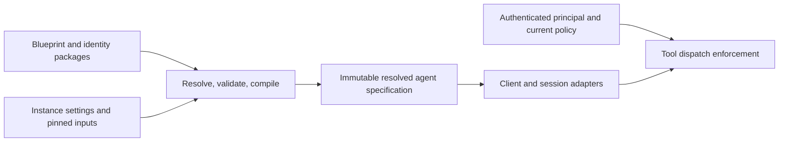

# Agent identities: architecture review

Owner-requested review for Avi, 2026-09-04. Work item: **WI-2144434**. Reviewed plan: **identities-v1-2026-08-30**, including the M1/M2/M3 requirements, design, implementation rulings, integration audit, and current staging source. These are recommendations, not amendments to the active plan. No product source was changed.

**Recommendation: continue the initiative, but use alpha to strengthen the blueprint composition and session activation boundaries before building more distribution infrastructure on them.** The plan has the right direction. Its most valuable result would be a small, explicit compiler and runtime contract shared by every agent surface. Moving existing prompt fragments onto a common loader is a useful migration toward that result, but does not establish it by itself.

## What is already good

- D-006/D-013 reuse the blueprint loader, package distribution, settings, and dependency machinery. Avoiding an independent identity store and installer is the right decision.
- Declared merge rules, exclusive slots, structural validation, and property tests improve on implicit deep merging.
- D-005/D-008/D-009 separate authored behavior from authority. Runtime permission checks must remain decisive; signed identity text does not confer permission.
- The plan already calls for pinned hashes, independently graded acceptance, prompt budgets, and staged milestones. These should be strengthened, not proposed again as if absent.
- D-014 keeps capability-class work off the prompt-composition critical path. That separation should survive any revision.

The file-canonical authoring model is reasonable. Git files can be the source, immutable packages the distribution unit, and Postgres a derived runtime index. A wholesale storage migration is not justified merely because identities are being introduced.

## 1. Separate source documents, resolved specifications, and live agents

The current BlueprintSchema includes executable workflow structure, pot configuration, fleet policy, deployment environment, role declarations, identity slots, and package references. Abstract identity documents deliberately omit fields a runnable blueprint needs. This is manageable while internal authors know the conventions; it becomes brittle as independent publishers compose modules.

There is a concrete example: the local Papercusp manifest deliberately declares a pot with no own slots. The real loader inherits the engineer domain slot, after which `isIdentityDocument(resolved.blueprint)` returns true. The raw document returns false. D-027 explicitly describes that pot as not being an identity. This is an API/type ambiguity; I found no production consumer of the helper and am not claiming a live UI failure.

Evidence: [local manifest](../../.papercusp/blueprint.yaml), [discriminator](../../libs/papercusp/packages/orchestrator/src/blueprint/schema.ts), [loader](../../libs/papercusp/packages/orchestrator/src/blueprint/loader.ts).

Keep one package envelope and one composition service, but give them distinct validated types:

| Concept | Meaning |
|---|---|
| Identity source document | Portable authored behavior and declared dependencies; its source kind does not change through inheritance. |
| Runnable blueprint | A composition that specifies an executable role/workflow. |
| Resolved agent specification | Immutable output of composition, with exact inputs and provenance. |
| Session activation | Desired and applied specification revisions for one running session. |
| Actor/principal | The accountable entity and authenticated authority; independent of the identity it wears. |

These types can share storage and package infrastructure. They need not become separate services or marketplaces. Preserve the product name “identity”; make its distinction from coordination `AgentIdentity` and session `ownerId` explicit in types and APIs.

## 2. Make composition produce one reproducible artifact

Today the YAML loader, prompt resolver, live su composer, generated doc parts, and Postgres projection participate in resolution at different times. The loader hashes the raw YAML layer, excluding attestation. That hash alone does not cover separately read prompt files. The prompt resolver also has its own chain walk and tier fallback; the PG resolver first returns a cached resolved blueprint. These are useful existing pieces, but they are not yet one immutable effective-agent artifact.

Evidence: [layerContentHash](../../libs/papercusp/packages/orchestrator/src/blueprint/loader.ts), [prompt resolution](../../libs/papercusp/packages/orchestrator/src/prompt-resolve.ts), [PG projection and reader](../../packages/operator-core/lib/blueprint/project-to-pg.ts).

Extend P-006's existing pinning work into an explicit compilation boundary:



The artifact should record the exact package closure, prompt bytes, addressed document revisions, compiler/schema version, resolved configuration, and per-field/per-section provenance. Keep mutable mode/policy state versioned separately. The session records which artifact and state revision it actually consumed. Live updates remain possible through explicit new revisions.

An “explain this agent” view should answer why each instruction, setting, tool, and dependency is present, which source supplied it, and which restriction controls it. Build that as a view over compiler provenance, not another independently maintained registry.

For publishing, sign and pin the complete content consumed by compilation, including prompt files and transitive dependencies. P-006/P-007 already intend per-layer hashes and update diffs; acceptance must prove that changing only a prompt file changes the relevant artifact identity. Distinguish a publisher signature from provider conformance evidence and from an administrator's permission grant.

## 3. Give each merge operation honest, enforceable semantics

I reproduced order dependence using the actual `mergeByRules` export:

```text
recipe/shared@1.0.0 + recipe/shared@2.0.0 -> recipe/shared@2.0.0
recipe/shared@2.0.0 + recipe/shared@1.0.0 -> recipe/shared@1.0.0
```

`bundles` is keyed by kind/ref. A colliding entry is deep-merged with the child winning. The current property test correctly checks commutativity of the identity-key set, not equality of the resolved values. D-020 documents that choice; this is a design concern, not a claim that the implementation violates its own current contract.

Evidence: [merge rules](../../libs/papercusp/packages/orchestrator/src/blueprint/merge-rules.ts), [unionArrays](../../libs/papercusp/packages/orchestrator/src/blueprint/merge.ts), [property tests](../../libs/papercusp/packages/orchestrator/src/blueprint/merge.test.ts). Recorded as **EI-22361787272570092**.

Separate set union, keyed overlay, constraint intersection, explicit replacement, and conflict rejection. Incompatible exact dependency pins should fail resolution, or require an explicit supported override with provenance. A higher-precedence layer should not accidentally choose which sibling's pinned dependency is broken. Numeric minimum is appropriate for an upper spending cap; other policies need their own ordering or constraint model.

Also separate inheritance/defaults from assembling peer modules. The current loader merges already-resolved parent trees; preserving that traversal is not proof that diamond inheritance and peer stacking have the desired semantics. Add diamonds, conflicting nested fields, removals, incompatible versions, and forbidden field contributions to the acceptance matrix.

Field ownership and explicit conflict handling are established approaches; Kubernetes Server-Side Apply is a useful reference for this principle, without suggesting that Papercusp should adopt Kubernetes. [Official documentation](https://kubernetes.io/docs/reference/using-api/server-side-apply/).

## 4. Treat live switching as a state transition with delivery acknowledgement

The current channel has a specific reliability defect. `consumePendingControlTransition` writes `control_delivered_generation` before the route renders the identity update. `renderStackTransitionContext` catches rendering failures and returns an empty block. The route can then return only the control line, with that generation already consumed. An unchanged control-state refresh does not itself create a new pending generation.

Evidence: [consumePendingControlTransition](../../packages/operator-core/lib/agent-tools/coordination/control-anchor.ts), [renderStackTransitionContext](../../packages/operator-core/lib/stack-binding-channel.ts), [turn-start caller](../../packages/operator-core/lib/endpoint-route/routes/agent-mcp/turn-start-memory.ts). The existing channel test explicitly accepts the empty result. Filed as **EI-22361786327908394**. This is code-path evidence, not a measured incident in a live user session.

Reuse the control anchor and its generation counter, but track desired versus applied stack revisions. Prepare and validate an update, deliver it with an idempotency key, and acknowledge the specific revision after the host accepts it. Retry or resynchronize failed delivery; do not report the new identity as applied while its text is missing. Test acknowledgement loss, rendering failure, rapid consecutive changes, restart, and recovery. Aim for at-least-once delivery with idempotent application, not an unsupported exactly-once transport claim.

Revocations must take effect immediately at the enforcement boundary. A render or acknowledgement failure must never postpone a permission reduction. Preserve the old valid behavioral configuration or pause affected work while a required new configuration cannot be applied.

Detaching an identity also cannot remove text already in a model's conversation. The current “treat the earlier section as VOID” message is a behavioral instruction, not context erasure. Offer a soft switch for suitable style changes and a fresh-context switch when isolation matters, with an explicit carry policy for work state and private memory. Make the distinction visible and test it across clients.

## 5. Keep authority and mandatory lifecycle work out of prose

The kernel-last statement is useful explanatory text. Its placement is not a security boundary or proof that a model obeys it. The code already acknowledges this; the acceptance criteria should use the same precision.

Consolidate policy evaluation behind a typed result, and enforce it at every reachable execution boundary, including indirect tool dispatch, installed rules, native tools, and shell access where available. An allowlisted tool name is insufficient to constrain what arbitrary shell access can do. This is an enforcement-coverage question, not evidence of a newly demonstrated bypass.

Move deterministic lifecycle obligations into the runtime when feasible: claim ownership, release on termination, revoke old privileges, acknowledge delivery, and record the actual execution revision. Keep task judgment and collaboration style in the identity. Reducing the kernel should mean reducing what an LLM must remember to do, not merely relocating the same instructions.

The policy-decision/enforcement separation is also the established model described by [Open Policy Agent](https://www.openpolicyagent.org/docs). This recommendation is to consolidate the existing Papercusp seams, not automatically introduce another policy engine.

## 6. Strengthen the milestones with a complete real example

Preserve the M1/M2/M3 structure, with these amendments:

1. **Before closing M1:** establish source-versus-resolved types and the compiler contract; fix transition delivery integrity; reconcile current requirements with later rulings that changed byte-equivalence into lossless reordering.
2. **For M2:** make complete-content pinning, dependency conflicts, provenance, and truthful activation state part of install/launch/switch acceptance. Test installation separately from activating a mutually incompatible stack. Define upgrade, rollback, and uninstall behavior for sessions still using an older version.
3. **Pull a local non-engineering example forward:** use real work to discover engineering-specific assumptions before expanding the package vocabulary. Retain P-014's full publish/provider/switch journey as final acceptance.
4. **For M3:** prove one narrow capability contract with two independent providers, negative authority tests, revocation, and version incompatibility. Keep the broader datatype/event/rule distribution work explicit and independently valuable; it should not obscure whether identities themselves work.

The plan already has LLM and independent-review gates. Add transition and recovery cases to them, and measure useful task performance, stale-role behavior, authority violations, prompt cost, and switching behavior. A smaller render and green golden tests are valuable migration evidence, but do not by themselves establish a better agent.

## Verification and limits

Executed the existing orchestrator tests for merge, merge-rule coverage, loader layers, stack mutation, and rendering: **42 tests passed**. Executed the operator stack-binding channel tests: **7 tests passed**. Reproduced bundle-version order dependence and the raw-versus-resolved identity discriminator using the actual TypeScript exports. Read the control transition writer and its caller before assessing delivery behavior.

No live session switch, publisher signature attack, cross-client LLM evaluation, or full release suite was run. Those remain acceptance work; this review does not certify shipment. The report is the only repository edit. The core refactor, plan amendments, and captured issues are recommendations, not completed implementation.

**The alpha investment I recommend is a coherent composition compiler plus a reliable activation protocol, built by refactoring the existing blueprint and control-anchor machinery.** Keep the useful infrastructure, remove ambiguous ownership and fallback semantics, and make every agent surface consume the same verifiable result.
